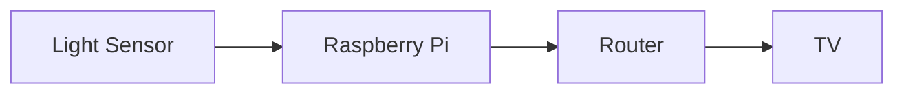

# EGL_315_Hologram

## Name
Quah Chin Heng

*Quah Chin Heng*

**Quah Chin Heng**

***Quah Chin Heng***

## School
There are 2 options to insert code

### Code Block
```
I am at Nanyang Polytechnic
Block S
Rooom 540
```

### Code Line
`sudo raspi-config`

### Adding Picture

When your something is wrong with your code


## Block Diagram

